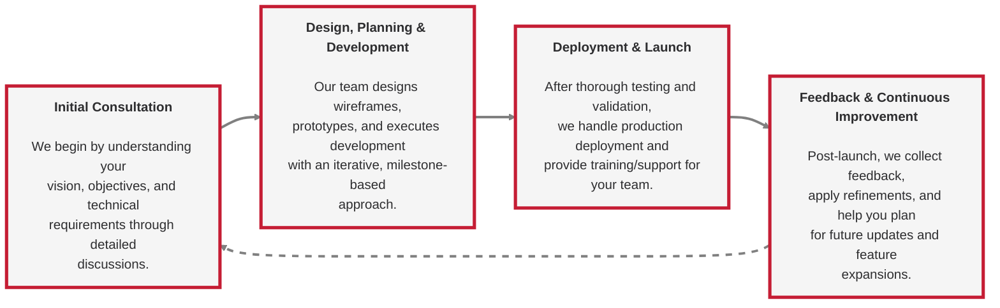

  
  

  
  

 

  <h3>🌐 Connect With Us</h3>
  

  
  &nbsp;&nbsp;
  
  &nbsp;&nbsp;
  
  &nbsp;&nbsp;
  
  &nbsp;&nbsp;
  
  &nbsp;&nbsp;
  
  &nbsp;&nbsp;
  
  &nbsp;&nbsp;
  

---

  <h2>🚀 Overview</h2>

**Backpack Tech Works** is a premier custom software development company specializing in building scalable, secure, and high-quality software solutions for enterprises and fast-growing brands. We transform complex business challenges into elegant, maintainable, and user-friendly software products through long-term partnerships, business-driven design, and technical excellence.

 

  <table>
    <tr>
      <td align="center" width="200">
        
         <strong>Web Development</strong>
      </td>
      <td align="center" width="200">
        
         <strong>Mobile Apps</strong>
      </td>
      <td align="center" width="200">
        
         <strong>Google Apps Script</strong>
      </td>
      <td align="center" width="200">
        
         <strong>UI/UX Design</strong>
      </td>
    </tr>
  </table>

---

  <h2>💼 Our Services</h2>

  <table cellpadding="20" cellspacing="0" border="0">
    <tr>
      <td align="center" width="50%" valign="top" style="padding: 20px;">
        <h3>
           
          Web Application Development
        </h3>
        

          We develop responsive, scalable, and robust web applications tailored to your business goals. 
          From custom dashboards to full-fledged platforms, our solutions are built to scale alongside your business.
        

         
        

          
          &nbsp;&nbsp;
          
          &nbsp;&nbsp;
          
          &nbsp;&nbsp;
          
            
          
          &nbsp;&nbsp;
          
            
          
          &nbsp;&nbsp;
          
        

      </td>
      <td align="center" width="50%" valign="top" style="padding: 20px;">
        <h3>
           
          Mobile Application Development
        </h3>
        

          Our mobile development team delivers cross-platform and native applications that combine performance, 
          usability, and beautiful design to provide a seamless user experience.
        

         
        

          
          &nbsp;&nbsp;
          
          &nbsp;&nbsp;
          
          
        

      </td>
    </tr>
    <tr>
      <td align="center" width="50%" valign="top" style="padding: 20px;">
        <h3>
           
          Google Apps Script Development
        </h3>
        

          We leverage Google Apps Script to build custom workflow automation, reporting systems, 
          and integrations within the Google Workspace ecosystem.
        

         
        

          
          &nbsp;&nbsp;
          
          &nbsp;&nbsp;
          
          &nbsp;&nbsp;
          
        

      </td>
      <td align="center" width="50%" valign="top" style="padding: 20px;">
        <h3>
           
          UI/UX Design and Branding
        </h3>
        

          Our design team creates intuitive user interfaces with a focus on usability, clarity, and brand alignment. 
          We help businesses stand out with professional UI/UX design and cohesive branding solutions.
        

         
        

          
          &nbsp;&nbsp;
          
          &nbsp;&nbsp;
          
        

      </td>
    </tr>
  </table>

---

  <h2>🎯 Our Approach</h2>

  <table cellpadding="20" cellspacing="0" border="0">
    <tr>
      <td align="center" width="33%" valign="top">
        
          
        <strong>Business-Driven Development</strong>
      </td>
      <td align="center" width="33%" valign="top">
        
          
        <strong>Quality-First Design</strong>
      </td>
      <td align="center" width="33%" valign="top">
        
          
        <strong>Security Standards</strong>
      </td>
    </tr>
  </table>

 

At Backpack Tech Works, we believe that software should not just function—it should provide tangible business value. We follow a structured, client-first approach that ensures clarity, quality, and measurable outcomes.

  <table>
    <tr>
      <td width="33%" valign="top">
        <h4> Business-Driven Development</h4>
        
We invest time to understand your business goals, ensuring that every feature aligns with measurable objectives and delivers real value.

      </td>
      <td width="33%" valign="top">
        <h4> Quality Design</h4>
        
All solutions we build prioritize simplicity, usability, and an enjoyable user experience while maintaining high visual standards.

      </td>
      <td width="33%" valign="top">
        <h4> Security Standards</h4>
        
Our web and mobile applications adhere to industry security best practices, including guidelines from OWASP, SANS, Apple, and Google.

      </td>
    </tr>
  </table>

---

  <h2>⭐ Why Choose Backpack Tech Works?</h2>

  <table>
    <tr>
      <th align="center" width="25%"> Feature</th>
      <th align="center" width="75%">Description</th>
    </tr>
    <tr>
      <td align="center"><strong>Tailored Solutions</strong></td>
      <td>We don't believe in one-size-fits-all. Every project is crafted to meet the specific needs of your business.</td>
    </tr>
    <tr>
      <td align="center"><strong>Strong Technical Foundation</strong></td>
      <td>Our team brings in-depth expertise across multiple technology stacks, ensuring performance, scalability, and maintainability.</td>
    </tr>
    <tr>
      <td align="center"><strong>Clear Communication</strong></td>
      <td>We believe transparency leads to better outcomes. Regular updates, clear milestones, and honest advice are part of our process.</td>
    </tr>
    <tr>
      <td align="center"><strong>Ongoing Support</strong></td>
      <td>Beyond delivery, we offer continuous support, maintenance, and improvement services to ensure your software evolves with your business.</td>
    </tr>
  </table>

---

  <h2>🔄 How We Work: Our Four-Step Process</h2>

  

  

